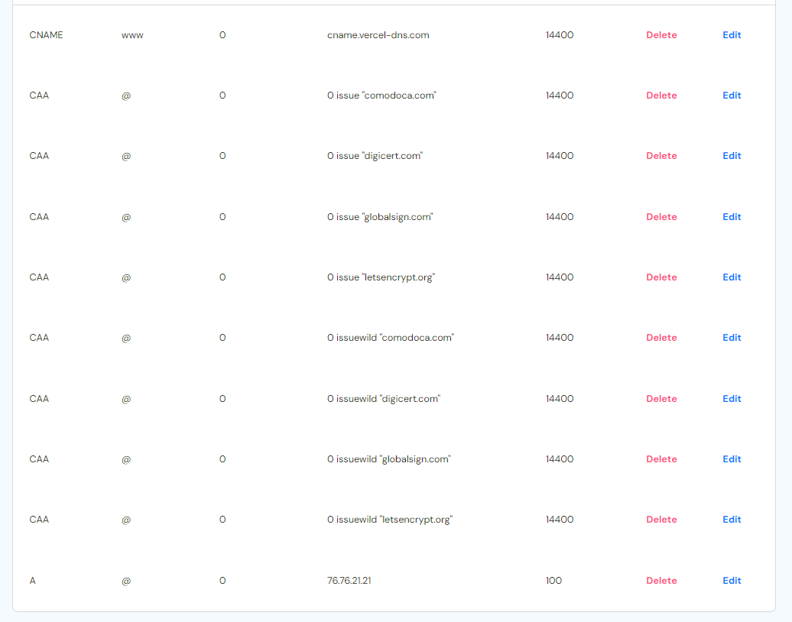

# Module 2 Assignment

di tugas kali ini saya akan menjelaskan tahapan/proses deployment yang telah saya kerjakan
berikut adalah tahapan-tahapan yang saya gunakan saat ingin mendeploy website saya yang bernamakan [supercats](https://www.supercats.site/).

langkah-langkah yang harus dilakukan:

## 1. membeli domain di niagahoster dan registrasi

membuka website [niaga hoster](https://www.niagahoster.co.id/domain-murah) cari nama domain yang diinginkan tekan tombol "cek sekarang", pilih pilihan domain yang paling murah setelah itu kita diminta persyaratan yang harus dilengkapi:

- pilih durasi sewa domain
- buat akun
- lakukan pembayaran

setelah ketiga persayaratan telah di isi maka,kita bisa langsung login ke akun niagahoster dengan akun yang telah di daftarkan.

ketika sudah login maka kita dapat memanage domain kita di halaman home,kita dapat melihat status domain kita aktif,email sudah terverifikasi dan kita juga dapat mengubah nama server kita dengan nama server yang telah di berikan di [cloudflare](https://www.cloudflare.com/).

setelah itu kita mengakses menu DNS/Nameservers untuk memanage DNS records yang nantinya akan kita ubah sesuai dengan apa yang di inginkan di vercel.

## 2. registrasi CloudFlare

membuat akun [CloudFlare](https://www.cloudflare.com/), setelah akun terbuat kita bisa langsung pergi ke dashboard buat menambahkan situs dengan memasukan situs yang kita ingin dan menekan tombol add site, lanjut ke memilih CloudFlare Plan yang gratis , setelah itu tekan tombol continue.

kita akan diarahkan ke halaman overview step selanjutnya adalah kita mengganti nama server yang ada pada niagahoster dengan nama server baru yang di berikan oleh cloudflare.

cara menggantinya kita pergi ke situs niaga hoster setelah kita login di niagahoster -> pilih domain -> name server setelah di name server kita bisa langsung ganti nama server ada di niagahoster dengan nama server yang diberikan cloudflare.

kita pergi kembali kehalaman cloudflare lalu perikasi nama server, tapi saat ini domain yang kita buat belom tentu aktif butuh waktu memperbarui nama server maksimal 24 jam.

jika domain kita sudah aktif maka kita situs niaga hoster lagi ke menu domain -> DNS/Nameservers setelah itu kita bisa menekan tombol "add record" lanjut ke situs vercel untuk mengganti kan DNS record

## 3. Register Vercel
membuka website [vercel](https://vercel.com/home)
membuat akun yang terhubung dengan github di dalam vercel, setelah berhasil membuat akun di vercel masuk kedalam halaman overview, menekan tombol "add new".

- pilih project
- import repository
- deploy
- pilih domain
- ganti DNS record yang ada pada vercel kedalam niagahoster dengan mengcopy

- copy DNS record ke dalam niagahoster dengan menekan tombol "add record"

setelah semua langkah telah dilakukan maka kita tinggal menunggu sistem membuat web yang telah kita bikin untuk mempunyai web sendiri

berikut hasil web dari [supercats](https://www.supercats.site/).

